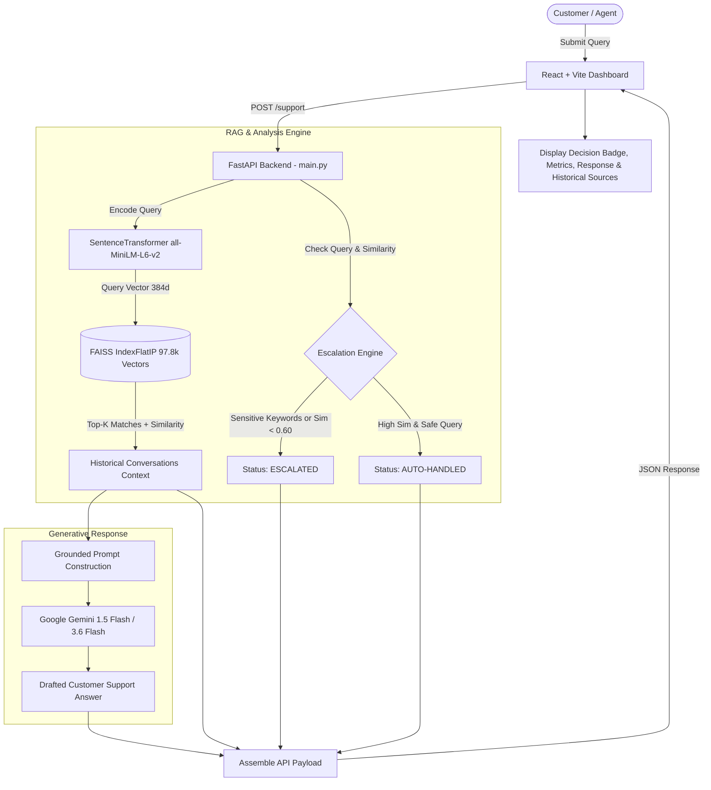

#  AppleSupport AI — Customer Support Agent

An end-to-end, production-grade AI customer support platform designed for Apple customer service interactions. Powered by **Retrieval-Augmented Generation (RAG)** with **Sentence Transformers**, a high-performance **FAISS** vector database containing **97,800+ historical AppleSupport conversations**, **Google Gemini**, and a rule-guided **Intelligent Escalation Engine**, paired with a modern **React + Vite** web dashboard.

---

## 📌 Table of Contents

- [Overview](#-overview)
- [Key Features](#-key-features)
- [System Architecture](#-system-architecture)
- [End-to-End Workflow](#-end-to-end-workflow)
- [Escalation & Safety Engine](#-escalation--safety-engine)
- [Intent Classification & Baselines](#-intent-classification--baselines)
- [Evaluation & Benchmarking](#-evaluation--benchmarking)
- [Project Structure](#-project-structure)
- [Getting Started](#-getting-started)
  - [Prerequisites](#prerequisites)
  - [1. Backend Setup](#1-backend-setup)
  - [2. Environment Configuration](#2-environment-configuration)
  - [3. Frontend Setup](#3-frontend-setup)
- [Running the Application](#-running-the-application)
- [API Reference](#-api-reference)
- [Data Pipeline & Evaluation Scripts](#-data-pipeline--evaluation-scripts)
- [Tech Stack](#-tech-stack)

---

## 🌟 Overview

Customer support at scale requires balancing rapid response times, brand consistency, strict accuracy, and safety. **AppleSupport AI** automates customer resolution by leveraging real-world conversation history between Apple Support and customers (derived from Twitter Customer Support dataset):

1. **Context-Aware Retrieval**: Embeds incoming customer questions using `all-MiniLM-L6-v2` and searches an index of **97,820 historical Apple customer interactions** via FAISS vector similarity.
2. **Deterministic Safety & Escalation**: Identifies sensitive inquiries (fraud, legal, hacked accounts, security threats) or low-confidence queries (< 0.60 similarity) to route them to human agents.
3. **Grounded Generation**: Feeds verified historical resolutions into **Google Gemini** to produce professional, empathetic, and factual responses without hallucinations.
4. **Interactive Dashboard**: A full-stack web UI built with React & Vite allowing real-time testing, similarity score breakdown, intent display, and retrieved reference inspection.

---

## 🚀 Key Features

- **⚡ High-Throughput Vector Search**: FAISS `IndexFlatIP` storing normalized 384-dimensional embeddings for 97,820 customer-support conversation pairs with sub-millisecond retrieval.
- **🛡️ 2-Tier Escalation Logic**:
  - *Keyword Sensitivity Rule*: Flags legal actions, security breaches, unauthorized charges, or stolen devices.
  - *Confidence Threshold Rule*: Automatically flags queries where top historical match drops below `0.60`.
  - *Evaluation Performance*: **92% Auto-Handled** vs. **8% Escalated** on a verified 200-sample Golden Set.
- **🎯 11-Class Intent Taxonomy**: Fine-grained categorization across:
  `refund`, `payment_billing`, `subscription`, `account_issue`, `software_update`, `battery_issue`, `connectivity_issue`, `app_issue`, `order_delivery`, `device_issue`, and `other`.
- **🧪 Multi-Tier Evaluation Suite**:
  - Golden Evaluation Set with verified ground truth and conversation chain tracking.
  - Baseline model comparison (TF-IDF + Logistic Regression vs. Sentence Transformer + Logistic Regression).
  - Data leakage prevention: Guarantees no self-match in evaluation retrieval.
  - LLM-as-a-Judge scoring (Relevance, Correctness, Fluency, Completeness).
  - Automated failure diagnostics (`analyze_failures.py`).
- **💻 Modern Full-Stack Experience**:
  - FastAPI backend with CORS, Pydantic validation, and structured error handling.
  - Responsive React 19 UI styled with custom CSS, animated metrics, and pipeline visualizers.

---

## 🏗️ System Architecture



---

## 🔄 End-to-End Workflow

1. **Ingestion & Preprocessing**: Raw Twitter customer support dialogues (`twcs.csv`) are matched into pairwise customer queries and official `@AppleSupport` replies, retaining tweet IDs and full conversation chains.
2. **Vector Indexing**: Customer messages are encoded using `SentenceTransformer("all-MiniLM-L6-v2")` into unit-normalized 384-dimensional vectors and indexed via inner product search (`IndexFlatIP`), equivalent to cosine similarity.
3. **Query Processing & Retrieval**: Incoming messages are embedded on-the-fly and queried against FAISS for the Top-5 nearest neighbors.
4. **Escalation Gate**: Queries are inspected for high-risk topics or low contextual overlap. If triggered, the system marks the ticket `ESCALATED` and states the specific rationale.
5. **Contextual Generation**: For auto-handled and escalated cases alike, Gemini synthesizes a tailored response strictly grounded in historical resolutions, adhering to Apple Support's tone guidelines.

---

## 🛡️ Escalation & Safety Engine

The escalation module (`escalation.py`) prevents erroneous or dangerous automated replies:

| Policy Check | Trigger Condition | Outcome | Action |
| :--- | :--- | :--- | :--- |
| **Sensitive Keyword Trigger** | `legal`, `lawsuit`, `chargeback`, `fraud`, `hacked`, `stolen`, `police`, `security`, `personal information` | `ESCALATED` | Routes ticket to specialized security/legal human reps. |
| **Confidence / Relevance Floor** | Best FAISS similarity score `< 0.60` | `ESCALATED` | Routes to human tier due to insufficient historical precedent. |
| **Standard Inquiries** | Score `≥ 0.60` without sensitive terms | `AUTO-HANDLED` | Dispatches AI-generated response directly to customer. |

---

## 📊 Intent Classification & Baselines

Intent classification is evaluated on a verified **Golden Set of 200 curated Apple customer interactions**, comparing traditional and embedding-based classifiers:

| Model Architecture | Accuracy | Weighted Precision | Weighted Recall | Weighted F1 | Macro F1 |
| :--- | :---: | :---: | :---: | :---: | :---: |
| **TF-IDF (1-2 n-grams) + Logistic Regression** | 45.00% | **64.55%** | 45.00% | 43.79% | **43.85%** |
| **Sentence Transformer (`all-MiniLM-L6-v2`) + Logistic Regression** | **45.50%** | 62.22% | **45.50%** | **44.17%** | 43.39% |

### Supported Intent Classes
- `refund`
- `payment_billing`
- `subscription`
- `account_issue`
- `software_update`
- `battery_issue`
- `connectivity_issue`
- `app_issue`
- `order_delivery`
- `device_issue`
- `other`

---

## 📈 Evaluation & Benchmarking

### 1. Escalation Reliability (Leakage-Free Evaluation)
Evaluated across 200 Golden Set test cases using `evaluate_escalation.py` with **self-match exclusion** (preventing identical historical conversation retrieval):
- **Auto-Handled Rate**: `92.0%` (184 / 200)
- **Escalated Rate**: `8.0%` (16 / 200)
- **Average FAISS Similarity**: `0.723`

### 2. LLM-as-a-Judge Evaluation (1 to 5 scale)
Evaluated using `evaluate_rag_gemini.py` on golden benchmarks:
- **Relevance**: `5.00 / 5.0`
- **Correctness**: `5.00 / 5.0`
- **Fluency**: `5.00 / 5.0`
- **Completeness**: `5.00 / 5.0`
- **Score Band**: `Excellent (5)`

---

## 📂 Project Structure

```
AppleSupport-AI/
├── data/
│   ├── raw/
│   │   └── twcs.csv                             # Raw customer support tweets
│   └── processed/
│       ├── apple_support.faiss                  # FAISS vector index (97.8k vectors)
│       ├── apple_support_clean.csv              # Cleaned customer-response pairs
│       ├── apple_support_labeled.csv            # Intent-annotated dataset
│       ├── golden_evaluation_final.csv          # Ground-truth golden test set (200 rows)
│       ├── baseline_comparison.csv              # TF-IDF vs. ST classifier benchmark
│       └── escalation_evaluation_no_self_match.csv # Leak-free escalation evaluation
├── frontend/                                    # React 19 + Vite frontend
│   ├── src/
│   │   ├── components/
│   │   │   ├── Header.jsx                       # Apple-themed navigation header
│   │   │   ├── QueryInput.jsx                   # Input form & submission controls
│   │   │   ├── ResultCard.jsx                   # Results container & pipeline viewer
│   │   │   ├── DecisionBadge.jsx                # AUTO-HANDLED vs. ESCALATED badge
│   │   │   ├── RetrievedConversation.jsx        # Historical context expander
│   │   │   └── Loading.jsx                      # Animated state loader
│   │   ├── api.js                               # Axios client connecting to FastAPI
│   │   ├── App.jsx                              # Main app orchestrator
│   │   ├── App.css                              # Component and layout styling
│   │   └── index.css                            # Base typography and design tokens
│   ├── package.json                             # Frontend dependencies & scripts
│   └── vite.config.js                           # Vite build configuration
├── .env                                         # Environment secrets (GEMINI_API_KEY)
├── main.py                                      # FastAPI application & REST endpoints
├── escalation.py                                # Escalation decision rules
├── rag_gemini.py                                # Interactive CLI RAG application
├── baseline_model.py                            # TF-IDF + Logistic Regression baseline
├── embedding_model.py                           # Sentence Transformer baseline
├── compare_baselines.py                         # Side-by-side baseline benchmark runner
├── build_faiss.py                               # FAISS index construction pipeline
├── preprocessing.py                             # Dialogue pairing from raw data
├── build_apple_context.py                       # Multi-turn context thread reconstructor
├── label_data.py                                # Heuristic intent labeling
├── evaluate_escalation.py                       # Escalation engine evaluation
├── evaluate_rag_gemini.py                       # LLM-as-a-judge evaluation suite
├── analyze_failures.py                          # Error diagnosis and failure reporting
└── README.md                                    # Project documentation
```

---

## 🛠️ Getting Started

### Prerequisites

- **Python**: 3.10+ (Recommended: 3.11 or 3.12)
- **Node.js**: v18+ & **npm**
- **Google Gemini API Key**: Obtainable from [Google AI Studio](https://aistudio.google.com/)

---

### 1. Backend Setup

1. Clone the repository:
   ```bash
   git clone https://github.com/sudharsini-0411/AppleSupport-AI.git
   cd AppleSupport-AI
   ```

2. Create and activate a Python virtual environment:
   ```powershell
   # Windows (PowerShell)
   python -m venv .venv
   .\.venv\Scripts\Activate.ps1

   # Linux / macOS
   python3 -m venv .venv
   source .venv/bin/activate
   ```

3. Install required Python packages:
   ```bash
   pip install fastapi uvicorn sentence-transformers faiss-cpu google-genai pandas scikit-learn python-dotenv
   ```

---

### 2. Environment Configuration

Create a `.env` file in the root directory:

```env
GEMINI_API_KEY="your-google-gemini-api-key-here"
```

---

### 3. Frontend Setup

1. Open a separate terminal and navigate to `frontend`:
   ```bash
   cd frontend
   npm install
   ```

---

## ⚡ Running the Application

### 1. Start the FastAPI Backend
From the root project directory (with the virtual environment activated):
```bash
uvicorn main:app --reload --port 8000
```
- API Health Check: `http://localhost:8000/`
- Interactive Swagger Docs: `http://localhost:8000/docs`

### 2. Start the React Frontend
From the `frontend/` directory:
```bash
npm run dev
```
Open your browser at: `http://localhost:5173`

---

## 🔌 API Reference

### `POST /support`

Analyzes customer query, performs vector search, checks escalation safety, and generates a grounded response.

#### Request Body
```json
{
  "message": "My iPhone 13 battery drains very quickly after updating to the latest iOS."
}
```

#### Response Example
```json
{
  "customer_message": "My iPhone 13 battery drains very quickly after updating to the latest iOS.",
  "decision": "AUTO-HANDLED",
  "reason": "Relevant historical conversations found",
  "intent": "battery_issue",
  "best_similarity": 0.8421,
  "generated_response": "We understand how important battery life is on your iPhone 13. Please check Settings > Battery > Battery Health to view your Maximum Capacity and see which apps are consuming power. Restarting your device and ensuring all apps are updated can also help. Let us know if you need further assistance!",
  "retrieved_conversations": [
    {
      "customer_message": "why is my battery draining super fast with iOS 11?",
      "support_response": "We'd like to help with your battery. Check out these tips for maximizing performance: apple.co/BatteryLife. Let us know if the issue persists.",
      "intent": "battery_issue",
      "similarity": 0.8421
    }
  ]
}
```

---

## 🔬 Data Pipeline & Evaluation Scripts

| Command | Purpose |
| :--- | :--- |
| `python preprocessing.py` | Extracts dialogue pairs from raw `twcs.csv` into `apple_support_conversations.csv`. |
| `python build_faiss.py` | Generates 384d sentence embeddings and builds `apple_support.faiss`. |
| `python compare_baselines.py` | Runs comparative benchmark between TF-IDF and Sentence Transformer models. |
| `python evaluate_escalation.py` | Benchmarks escalation decisions against 200 Golden Set queries without self-match leaks. |
| `python evaluate_rag_gemini.py` | Runs automated LLM-as-a-judge scoring on generated responses. |
| `python analyze_failures.py` | Analyzes low-confidence and failing queries to generate `top5_failures.csv`. |
| `python rag_gemini.py` | Interactive terminal-based customer support chat session. |

---

## 🧰 Tech Stack

- **Large Language Model**: Google Gemini (`gemini-1.5-flash` / `gemini-3.6-flash` via `google-genai` SDK)
- **Vector Search & Embeddings**: FAISS (`faiss-cpu`), `sentence-transformers` (`all-MiniLM-L6-v2`)
- **Machine Learning**: `scikit-learn` (TF-IDF Vectorizer, Logistic Regression, Classification Metrics)
- **Data Engineering**: `pandas`, `numpy`
- **Backend**: FastAPI, Uvicorn, Pydantic
- **Frontend**: React 19, Vite, Axios, Modern Vanilla CSS

---

## 📄 License

This project is licensed under the MIT License.
